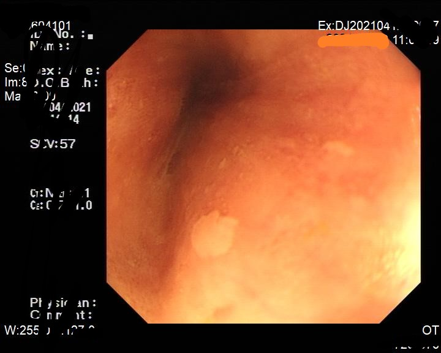
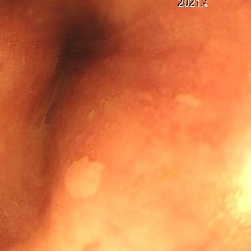
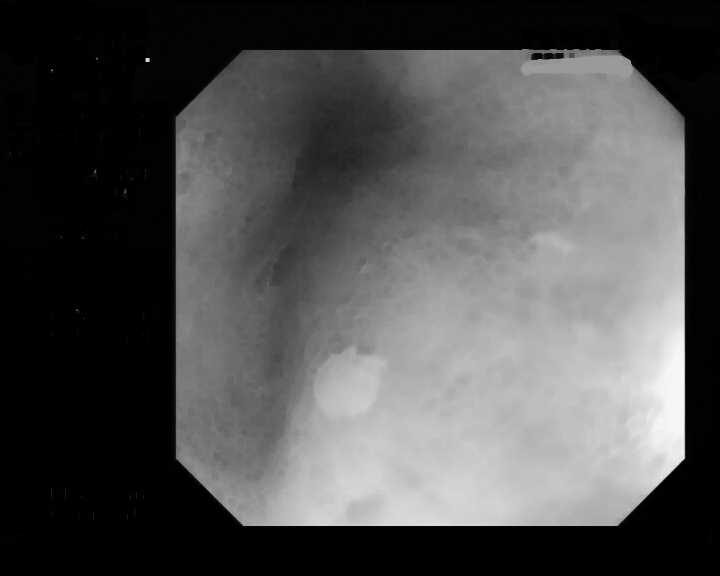
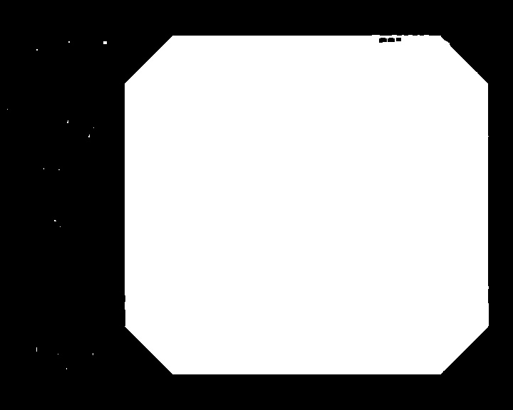
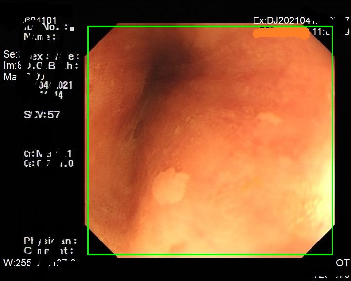

这是一个制作食道癌数据集的文件夹，用于消除食道癌数据集的黑边

最终效果如图：

|原图|处理后|
|---------|---------|
|<left><left> |<left><left>|
|<left><left>|<left><left>|

# 第一步
|原图|腐蚀去掉文字|
|:---------:|:---------:|
|<left><left>|<left><left> |

|二值化|根据二值找得|裁剪|
|:---------:|:---------:|:---------:|
|<left><left>|<left><left>|<left><left>|

# 第二步
|原图|对四角进行镜像|
|:---------:|:---------:|
|<left><left>|<left><left>|

# 第三步
|原图|重设统一大小|
|:---------:|:---------:|
|<left><left>|<left><left>|