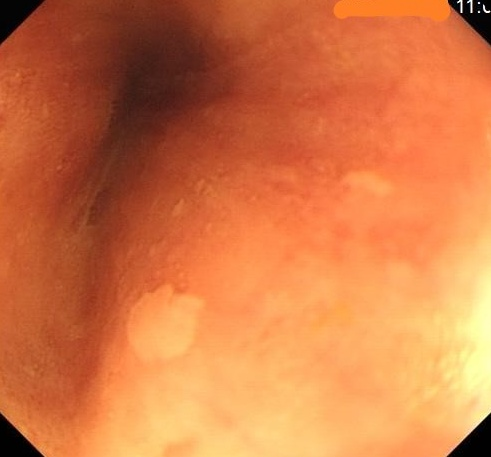

这是一个制作食道癌数据集的文件夹，用于消除食道癌数据集的黑边。
制作之后的图片主要用于模型训练，制作过程主要存在以下问题：

1. 问题一：原始数据集存在黑边，会影响图片增强效果
2. 问题二：原数据图片大小不一致，不方便制作ROI
3. 问题三：如何寻找得到感兴趣区域
4. 问题四：最终得到的矩形，四个角应该如何补齐

数据集对应的掩膜跟随原图(裁剪，镜像)一起操作，就能保证数据级仍然对齐，最终效果如图：
|原图|处理后|
|---------|---------|
|<left><left> |<left><left>|
|<left><left>|<left><left>|

# 第一步
|原图|腐蚀去掉文字|
|:---------:|:---------:|
|<left><left>|<left><left> |

|二值化|根据二值找得|裁剪|
|:---------:|:---------:|:---------:|
|<left><left>|<left><left>|<left><left>|

# 第二步
|原图|对四角进行镜像|
|:---------:|:---------:|
|<left><left>|<left><left>|

# 第三步
|原图|重设统一大小|
|:---------:|:---------:|
|<left><left>|<left><left>|