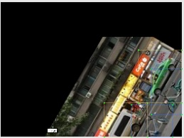
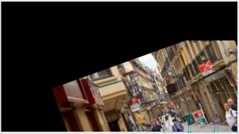

# 项目说明
这是一个制作目标检测数据增强的文件夹，用于增强数据集。
制作之后的图片主要用于模型训练，制作过程主要存在以下问题：

1. 问题一：如果旋转，拉伸原图，标注框如何也同步旋转，拉伸
2. 问题二：同一张图片一个类别可能存在多个标注狂
3. 问题三：同一张图片存在多个类别的标注框
4. 问题四：标注框可能是重叠的

# 项目操作使用

0. 具体使用方式查看 main.py 代码调用方式
1. strengthen文件夹是增强方式，可以直接复制放在个人工程中直接调用

解决思路图示：

|1.原图与标注|2.对原图的增强处理|3.绘制黑底白面标注，并增强|
|---------|---------|---------|
|<left><left> |<left><left>|<left><left>|

|3.识别旋转后的区域|4.新的矩形框放进原图|
|---------|---------|
|<left><left> |<left><left>|

# 项目详细细节

|原图|旋转原图与注释|
|---------|---------|
|<left><left> |<left><left>|

|原图|翻转原图与注释|
|---------|---------|
|<left><left> |<left><left>|

|原图|仿射变换原图与注释|
|---------|---------|
|<left><left> |<left><left>|

|原图|裁剪原图的四边|
|---------|---------|
|<left><left> |<left><left>|

|原图|镜像填充原图与标注|
|---------|---------|
|<left><left> |<left><left>|