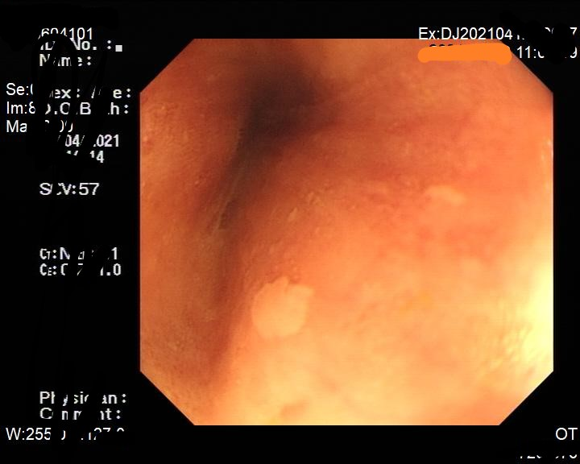
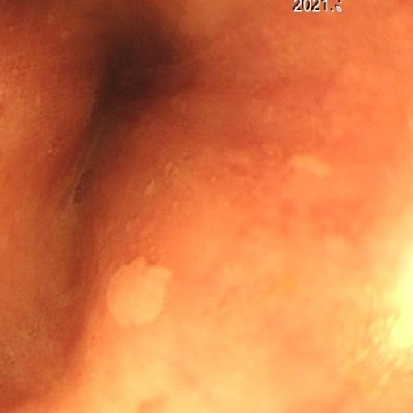
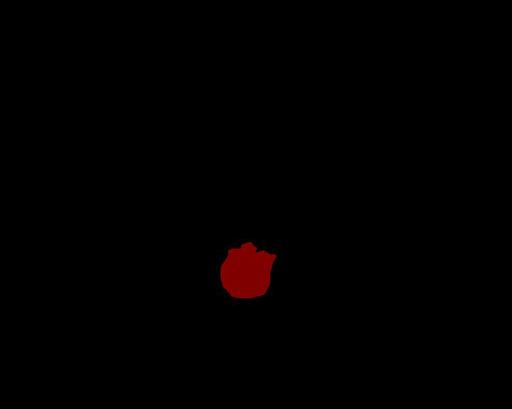
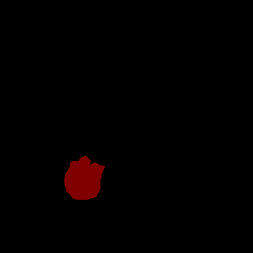
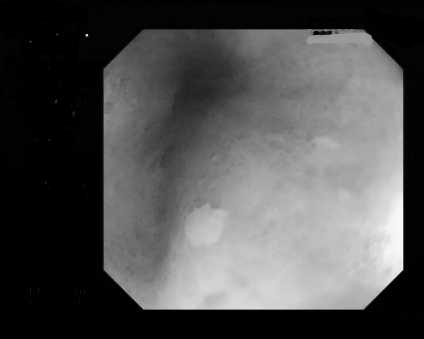
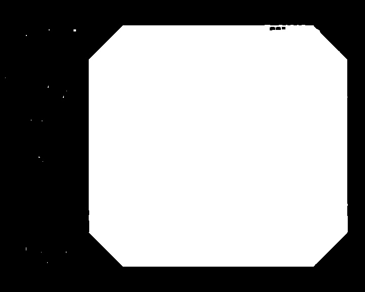
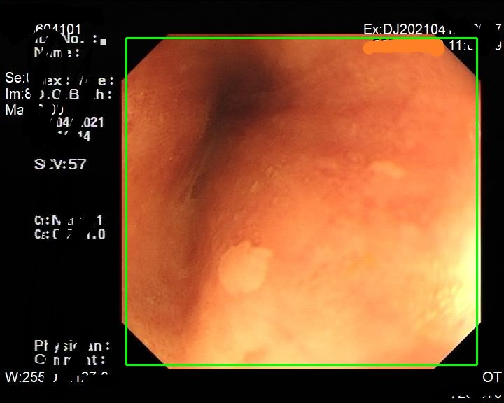
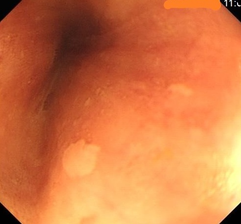

# 项目说明
这是一个制作食道癌数据集的文件夹，用于消除数据集的黑边。
制作之后的图片主要用于模型训练，制作过程主要存在以下问题：

1. 问题一：原始数据集存在黑边，会影响图片增强效果
2. 问题二：原数据图片大小不一致，不方便制作ROI
3. 问题三：如何寻找得到感兴趣区域
4. 问题四：最终得到的矩形，四个角应该如何补齐

# 项目操作使用
0. 先清空 step0-3 文件夹下的图片
1. 将数据集原图与对应的标注图复制到 step0 文件夹。注意名字对齐
2. 依次运行 step1_find_maxarea.py step2_repaired.py step3_resize.py
3. 最终结果保存在 step3 文件夹里

# 项目详细细节
数据集对应的掩膜跟随原图(裁剪，镜像)一起操作，就能保证数据集仍然对齐，最终效果如图：
|原图|处理后|
|---------|---------|
|<left><left> |<left><left>|
|<left><left>|<left><left>|

# 第一步

这个步骤的主要目的是，裁剪出图片的核心矩形区域

主要步骤是：

1. 腐蚀去掉文字
2. 二值化
3. 根据二值图找得最大矩形区域
4. 根据矩形区域再原图上裁剪

|原图|腐蚀去掉文字|
|:---------:|:---------:|
|<left><left>|<left><left> |

|二值化|根据二值找得|裁剪|
|:---------:|:---------:|:---------:|
|<left><left>|<left><left>|<left><left>|

# 第二步

这个步骤的主要目的是，对裁剪后的四个角进行补齐，主要方法是再四个角的区域进行镜像对称，之所以补齐是因为黑块会让图像增强变得不适定
   
|原图|对四角进行镜像|
|:---------:|:---------:|
|<left><left>|<left><left>|

# 第三步
这个步骤的主要目的是，由于原数据集图片大小不是统一的，这里统一输出 512*512 大小

|原图|重设统一大小|
|:---------:|:---------:|
|<left><left>|<left><left>|